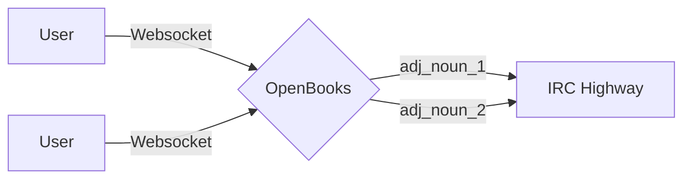
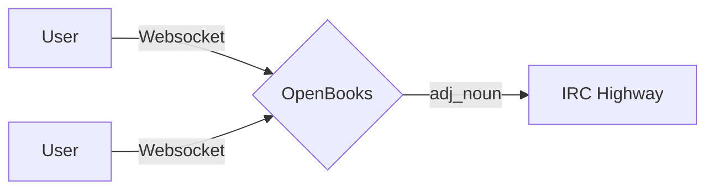

## Current

Each user creates a new "Client" which consists of a websocket connection and an IRC connection.
This is how we isolate the user's IRC responses to the correct websocket.

## Future

OpenBooks would maintain a single IRC connection regardless of the number of clients and route the IRC responses to the correct client.
The difficulty is determining the internal logic to determine who the response goes to based on the IRC message.

